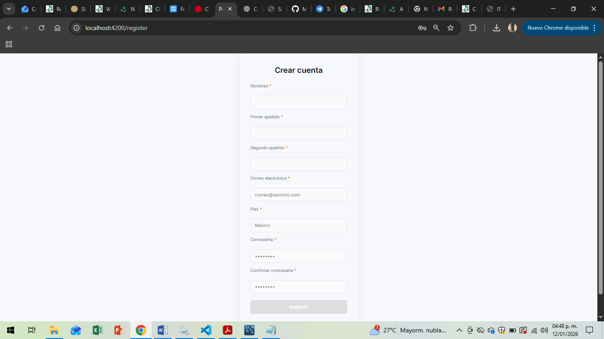
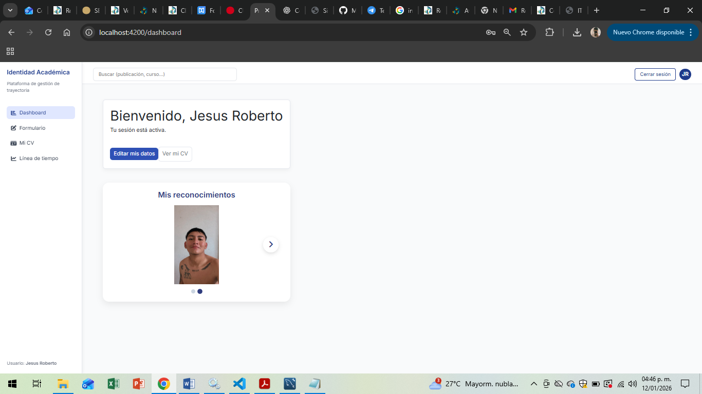

# Proyecto de Residencias – Plataforma de Identidad Digital

## Descripción
Este proyecto corresponde al desarrollo de una plataforma de identidad digital realizada como parte de las Residencias Profesionales de la carrera de Ingeniería en Sistemas Computacionales.

El sistema sigue una arquitectura cliente-servidor, donde el frontend consume una API REST desarrollada en el backend. La plataforma permite la gestión y autenticación de usuarios, así como el manejo seguro de la información.

---

## Objetivo General
Desarrollar y desplegar una plataforma web funcional para la gestión de identidad digital, aplicando buenas prácticas de desarrollo de software y considerando un entorno de producción real.

---

## Tecnologías Utilizadas

### Frontend
- Angular
- TypeScript
- HTML5
- CSS3

### Backend
- Node.js
- NestJS
- TypeScript
- MySQL

### Herramientas
- Git
- GitHub
- Visual Studio Code
- Postman
- Nginx

---

## Estructura del Proyecto y Despliegue en Entorno de Producción

proyecto-de-residencias/
├── backend/        API REST y lógica del servidor
├── frontend/       Aplicación Angular
├── screenshots/    Capturas de pantalla del sistema
└── README.md       Documentación del proyecto

## DESPLIEGUE EN ENTORNO DE PRODUCCIÓN

## BACKEND (NestJS)

1. Acceder a la carpeta del backend
   cd backend

2. Instalar dependencias
   npm install

3. Configurar variables de entorno en el archivo .env

4. Compilar el proyecto
   npm run build

5. Ejecutar el servidor en modo producción
   npm run start

## El backend queda disponible en el puerto configurado en el servidor.

## FRONTEND (Angular)

1. Acceder a la carpeta del frontend
   cd frontend

2. Instalar dependencias
   npm install

3. Generar la versión de producción
   npm run build

## Este comando genera la carpeta dist/, la cual debe ser desplegada en un servidor web como Nginx o Apache.
No se utiliza ng serve, ya que es exclusivo para entornos de desarrollo.

---

## Capturas de Pantalla

### Inicio de sesión

### Panel principal

---

## Autor
Nombre: Jesús Roberto Canul Cocom
Carrera: Ingeniería en Sistemas Computacionales
Proyecto: Residencias Profesionales

---

## Estado del Proyecto
Listo para validación y despliegue en entorno de producción.

